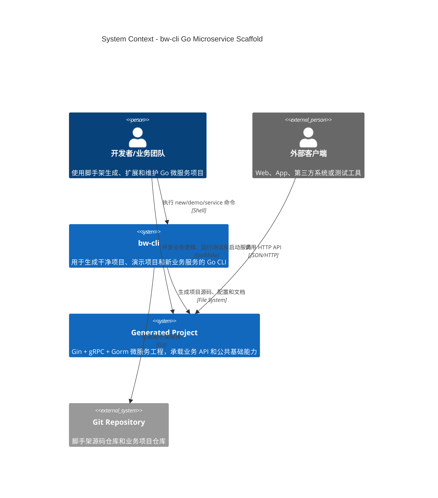
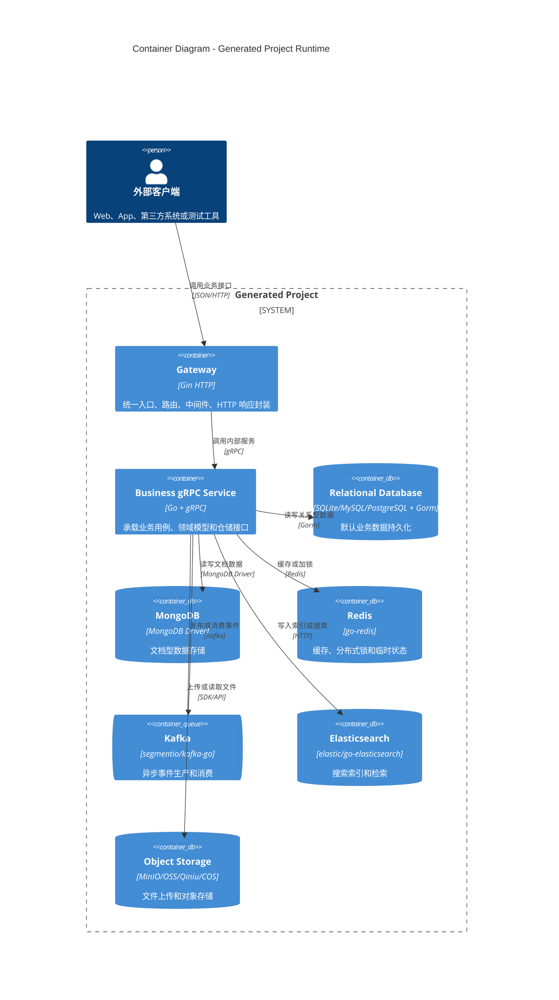
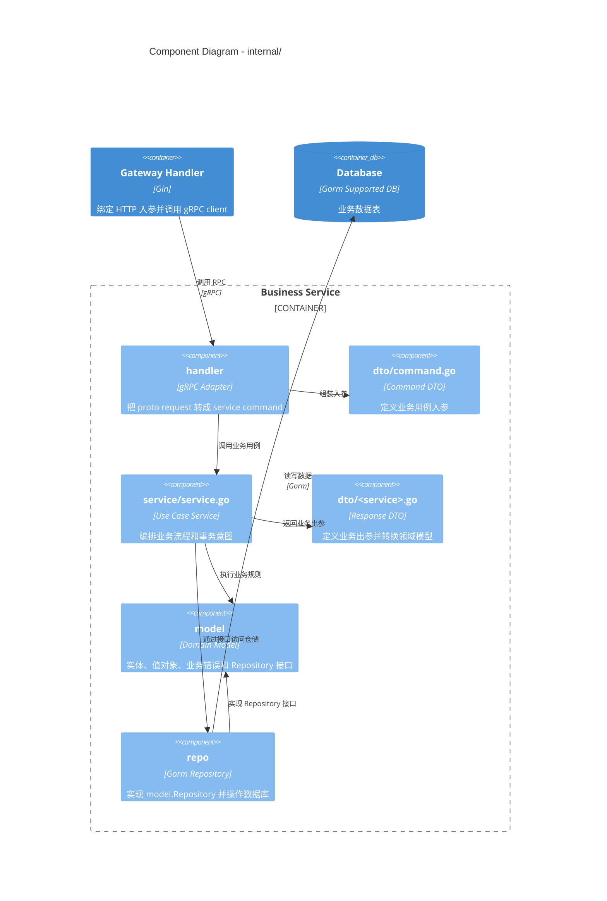

# bw-cli Go 微服务脚手架

`bw-cli` 是一套面向企业项目的 Go 微服务脚手架，默认使用 Gin + gRPC + Gorm，按 DDD 思路组织代码，同时保持包名简单直观。`bw-cli new` 默认生成不带业务 demo 的干净框架；如果需要演示项目，可以使用 `bw-cli demo` 生成带 `user-service` 和 `note-service` 的示例工程。

## 1. 你可以用它做什么

- 快速生成 Gin + gRPC 微服务项目。
- `bw-cli new <项目名> --module <module>` 一条命令生成干净框架。
- `bw-cli demo <项目名> --module <module>` 单独生成带示例业务的演示项目。
- `bw-cli service <服务名> --tidy` 在现有项目中生成可启动的基础 CRUD 服务。
- 使用清晰的 DDD 分层：`model`、`service`、`repo`、`handler`。
- 默认支持 Gorm，并内置 SQLite、MySQL、PostgreSQL。
- 内置 MongoDB、Redis、Elasticsearch、Kafka 客户端封装。
- 内置文件上传封装，支持 MinIO、阿里云 OSS、七牛云 Kodo、腾讯云 COS。
- 内置 CORS、JWT、RequestID、请求日志等常用中间件。
- 使用 Zap + Lumberjack 记录结构化日志，日志默认保留 7 天。
- 通过 `make` 命令完成 proto 生成、测试和本地启动。

## 2. 环境要求

先确认本机环境：

```bash
go version
protoc --version
git --version
make --version
```

要求：

```text
Go        1.25+
protoc    3.x+
Git       任意现代版本
Make      macOS/Linux 默认可用
```

如果缺少 `protoc`，macOS 可以使用：

```bash
brew install protobuf
```

如果 `bw-cli` 安装后提示 `command not found`，检查 Go bin 目录：

```bash
go env GOPATH
```

然后把下面内容加入你的 shell 配置：

```bash
export PATH="$PATH:$(go env GOPATH)/bin"
```

## 3. 方式一：拉取脚手架后直接本地运行

这个方式适合第一次体验脚手架，或者你要参与维护 `bw-cli` 本身。

### 3.1 克隆仓库

```bash
git clone https://github.com/BwCloudWeGo/bw-cli.git
cd bw-cli
```

### 3.2 安装 proto 插件

```bash
make tools
```

它会安装：

```text
protoc-gen-go
protoc-gen-go-grpc
```

### 3.3 生成 proto 代码

```bash
make proto
```

这一步会根据 `api/proto` 下的 proto 文件生成 `api/gen` 下的 Go 代码。

### 3.4 整理依赖

```bash
make tidy
```

### 3.5 运行测试

```bash
make test
```

看到所有 package 都没有 `FAIL` 即可继续启动服务。

### 3.6 启动 demo 服务

建议开三个终端，按顺序启动。

终端一：启动用户服务。

```bash
make run-user
```

终端二：启动笔记服务。

```bash
make run-note
```

终端三：启动网关。

```bash
make run-gateway
```

默认端口：

```text
gateway       http://localhost:8080
user-service  grpc://localhost:9001
note-service  grpc://localhost:9002
```

### 3.7 验证服务

健康检查：

```bash
curl http://localhost:8080/healthz
```

注册用户：

```bash
curl -X POST http://localhost:8080/api/v1/users/register \
  -H 'Content-Type: application/json' \
  -d '{"email":"ada@example.com","display_name":"Ada","password":"<password>"}'
```

登录用户：

```bash
curl -X POST http://localhost:8080/api/v1/users/login \
  -H 'Content-Type: application/json' \
  -d '{"email":"ada@example.com","password":"<password>"}'
```

创建笔记：

```bash
curl -X POST http://localhost:8080/api/v1/notes \
  -H 'Content-Type: application/json' \
  -d '{"author_id":"<user_id>","title":"DDD scaffold","content":"Gin plus gRPC demo"}'
```

发布笔记：

```bash
curl -X POST http://localhost:8080/api/v1/notes/<note_id>/publish
```

## 4. 方式二：安装 bw-cli 并生成新项目

这个方式适合业务项目使用。你只需要安装一次 `bw-cli`，后续可以随时生成新项目。

### 4.1 通过远程仓库安装

```bash
go install github.com/BwCloudWeGo/bw-cli/cmd/bw-cli@latest
```

验证命令是否可用：

```bash
bw-cli new -h
```

### 4.2 生成干净业务项目

```bash
bw-cli new my-service \
  --module github.com/acme/my-service \
  --tidy
```

`bw-cli new` 默认从 `https://github.com/BwCloudWeGo/bw-cli.git` 的 `main` 分支拉取脚手架，并自动清理 demo 代码。日常使用只需要指定项目目录和 module。

参数说明：

| 参数 | 说明 |
| --- | --- |
| `my-service` | 生成出来的新项目目录 |
| `--module github.com/acme/my-service` | 新项目的 Go module |
| `--tidy` | 生成后自动执行 `go mod tidy` |

生成完成后：

```bash
cd my-service
make tools
make proto
make test
```

启动干净项目的 gateway：

```bash
make run-gateway
```

端口监听成功后，控制台会直接输出启动项：

```text
[Gateway Started]
  service: gateway
  env: local
  listen: 0.0.0.0:8080
  http: http://127.0.0.1:8080
  health: http://127.0.0.1:8080/healthz
  api: http://127.0.0.1:8080/api/v1
```

如果端口被占用，控制台会输出 `[Gateway Start Failed]`，并显示失败的监听地址和系统错误。

验证：

```bash
curl http://localhost:8080/healthz
```

### 4.3 生成演示项目

如果想先看完整 user/note 示例，用 `demo` 命令：

```bash
bw-cli demo demo-service \
  --module github.com/acme/demo-service \
  --tidy
```

生成后按第 3.6 节的方式启动三个服务。

### 4.4 从本地脚手架源码生成项目

如果你正在修改脚手架本身，可以直接用本地源码生成项目：

```bash
git clone https://github.com/BwCloudWeGo/bw-cli.git
cd bw-cli
go install ./cmd/bw-cli

bw-cli new ../my-service \
  --module github.com/acme/my-service \
  --source . \
  --tidy
```

如果要从本地源码生成带示例业务的演示项目：

```bash
bw-cli demo ../demo-service \
  --module github.com/acme/demo-service \
  --source . \
  --tidy
```

这适合调试模板变更，不需要每次都先推送到远程仓库。

### 4.5 bw-cli 生成时做了什么

`bw-cli new` 会执行这些动作：

1. 默认从官方仓库克隆脚手架；如果传了 `--source`，则复制本地脚手架。
2. 跳过 `.git`、`.idea`、`logs`、`data`、`tmp` 等运行时目录。
3. 把 `go.mod`、源码、配置和文档中的旧 module 路径替换成新项目 module。
4. 跳过已生成的 `*.pb.go`，避免破坏 protobuf 原始描述符。
5. 替换 `.proto` 文件中的 `go_package`。
6. `new` 会移除 user/note 示例服务、示例 proto、示例 gateway handler 和脚手架自身 CLI 代码。
7. `demo` 会保留 user/note 示例服务，方便学习和演示。
8. 重写生成项目内的 README、usage、architecture、toolkit、mongodb 文档，让文档和实际目录保持一致。
9. 如果指定 `--tidy`，自动执行 `go mod tidy`。

生成后建议执行：

```bash
make proto
make test
```

`make proto` 会基于新的 `go_package` 重新生成 `*.pb.go`。

## 5. 生成新的业务服务

进入已生成的项目根目录，直接执行：

```bash
bw-cli service order --tidy
```

这条命令会自动读取当前项目的 `go.mod`，并生成一整套可编译、可启动、带基础 CRUD 的服务代码，同时把服务配置追加到 `configs/config.yaml`：

```text
api/proto/order/v1/order.proto
api/gen/order/v1
cmd/order/main.go
internal/order/model
internal/order/dto/command.go
internal/order/dto/order.go
internal/order/service/service.go
internal/order/repo/gorm_repository.go
internal/order/repo/mongo_repository.go
internal/order/handler
docs/services/order.md
```

同时会在 `Makefile` 中追加：

```bash
make run-order
```

默认 gRPC 端口是 `9100`。如果需要指定端口，可以在生成时传 `--port`：

```bash
bw-cli service order --port 9103 --tidy
```

命令会把服务配置写入 `configs/config.yaml`：

```yaml
services:
  order:
    name: order-service
    port: 9103
    target: 127.0.0.1:9103
```

需要修改端口时，直接修改 `services.order.port`；gateway 连接地址同步修改 `services.order.target`。如果启用了 Nacos，把本地新增的 `services.order` 同步到 Nacos 中的完整业务配置。

生成后的基础调用链已经成型：

```text
HTTP client -> gateway router/handler -> gRPC client -> proto -> handler -> service -> model.Repository -> repo(Gorm) -> database
```

默认启动使用 `repo/gorm_repository.go`。命令也会生成 `repo/mongo_repository.go`，其中已经包含 `MongoCollectionName()`、`mongox.NewDocumentStore[T]` 和基础 CRUD 方法；如果该服务需要改用 MongoDB，只需要在 `cmd/order/main.go` 中改为注入 `repo.NewMongoRepository`。

默认提供：

```text
CreateOrder
GetOrder
ListOrders
UpdateOrder
DeleteOrder
```

用户可以直接把示例字段 `Name`、`Description` 替换成真实业务字段，或者在现有 CRUD 上继续增加业务方法。

如果项目包含 gateway，命令会同步生成：

```text
internal/gateway/request/order_request.go
internal/gateway/handler/order_handler.go
internal/gateway/router/order_routes.go
```

并自动挂载：

```text
POST   /api/v1/orders
GET    /api/v1/orders
GET    /api/v1/orders/:id
PUT    /api/v1/orders/:id
DELETE /api/v1/orders/:id
```

gateway 默认读取 `services.order.target`，例如 `127.0.0.1:9103`。

生成后常用流程：

```bash
make proto
make test
make run-order
```

## 6. 项目目录说明

下面是脚手架仓库源码目录。通过 `bw-cli new` 生成的干净项目会移除 `cmd/bw-cli`、`cmd/user`、`cmd/note`、`internal/user`、`internal/note` 和示例 proto；通过 `bw-cli demo` 生成的演示项目会保留 user/note 示例。

核心目录：

```text
.
├── api
│   ├── proto        # proto 源文件
│   └── gen          # protoc 生成的 Go 代码
├── cmd
│   ├── bw-cli       # 脚手架命令入口
│   ├── gateway      # HTTP 网关进程
│   ├── user         # user-service 进程
│   └── note         # note-service 进程
├── configs          # 本地配置文件
├── docs             # 架构和使用文档
├── internal
│   ├── gateway      # Gin 网关
│   ├── user         # 用户服务
│   └── note         # 笔记服务
├── pkg              # 可复用基础包
└── Makefile
```

业务服务统一四层：

```text
internal/<service>
  ├── model    # 实体、值对象、业务错误、仓储接口
  ├── dto
  │   ├── command.go    # 业务用例入参命令
  │   └── <service>.go  # 业务用例出参 DTO 和转换
  ├── service
  │   └── service.go    # 业务流程编排
  ├── repo     # Gorm、MongoDB、Redis、外部依赖实现
  └── handler  # gRPC/HTTP 入站适配
```

Gateway 额外拆分：

```text
internal/gateway
  ├── request          # HTTP 入参 DTO
  ├── handler          # HTTP 控制器
  └── router
      ├── v1.go        # /api/v1 版本路由
      ├── user_routes.go
      └── note_routes.go
```

依赖方向：

```text
handler -> service -> model
repo -> model
```

`model` 不依赖 Gin、gRPC、Gorm、MongoDB SDK 或日志框架，便于测试和替换基础设施。
`service.go` 只写业务流程；命令入参放 `dto/command.go`，返回 DTO 和转换函数放 `dto/<service>.go`，避免控制器或服务主文件堆字段。

### 6.1 C4 架构图说明

README 使用 C4 模型描述架构，便于从“系统边界 -> 运行容器 -> 服务内部组件”逐层理解。图中的 `bw-cli` 是脚手架命令本身，`Generated Project` 是通过 `bw-cli new` 或 `bw-cli demo` 生成的业务工程。

#### Level 1：系统上下文



#### Level 2：生成项目容器视图



#### Level 3：业务服务组件视图



这三张图对应开发时的三个判断：

- 看系统边界时，先看 Level 1，确认 `bw-cli`、生成项目、外部调用方和 Git 仓库的关系。
- 看运行时调用链时，看 Level 2，确认 gateway、gRPC 服务和各类数据源之间的依赖。
- 写具体业务代码时，看 Level 3，确认入参、业务流程、DTO、领域模型和数据库实现分别放在哪一层。

## 7. 常用 Make 命令

Makefile 只调用 Go 命令，不依赖 `find`、`sed`、`if [ ... ]` 等 Unix shell 语法；`make proto` 内部通过 `tools/protogen` 使用 Go 自动适配 Windows、macOS、Linux 的路径分隔符和插件目录。
Windows 仍需要安装 GNU Make；如果没有 `make`，可以直接执行等价的 Go 命令，例如 `go run ./tools/protogen`、`go test ./...`、`go run ./cmd/gateway`。

| 命令 | 作用 |
| --- | --- |
| `make tools` | 安装 proto 生成插件 |
| `make proto` | 生成 gRPC/protobuf Go 代码 |
| `make tidy` | 执行 `go mod tidy` |
| `make test` | 执行 `go test ./...` |
| `make run-user` | 启动 user-service |
| `make run-note` | 启动 note-service |
| `make run-gateway` | 启动 HTTP gateway |
| `make install-cli` | 本地安装 `bw-cli` |

## 8. 配置说明

默认配置文件：

```text
configs/config.yaml
```

### 7.1 默认数据库

默认使用 SQLite，适合本地快速体验：

```yaml
database:
  driver: sqlite
  dsn: data/xiaolanshu.db
```

SQLite 文件会写入 `data/` 目录，该目录已被 `.gitignore` 忽略。

### 7.2 切换 MySQL

```yaml
database:
  driver: mysql

mysql:
  dsn: ""
  max_idle_conns: 10
  max_open_conns: 100
  conn_max_lifetime_seconds: 3600
```

### 7.3 切换 PostgreSQL

```yaml
database:
  driver: postgres

postgresql:
  dsn: ""
  max_idle_conns: 10
  max_open_conns: 100
  conn_max_lifetime_seconds: 3600
```

支持的关系型数据库 driver：

```text
sqlite
mysql
postgres
postgresql
pg
```

### 7.4 MongoDB

默认配置：

```yaml
mongodb:
  uri: mongodb://127.0.0.1:27017
  username: ""
  password: ""
  database: xiaolanshu
  app_name: bw-cli
  min_pool_size: 0
  max_pool_size: 100
  connect_timeout_seconds: 10
  server_selection_timeout_seconds: 5
```

服务启动时会读取 `configs/config.yaml` 中的 `mongodb.*` 配置，并通过 `cfg.MongoDB.MongoxConfig()` 创建连接。用户名、密码、数据库名都写在配置文件对应字段中。

业务仓储建议通过公共操作类读写 collection：

```go
type NoteDocument struct {
    ID    string `bson:"_id"`
    Title string `bson:"title"`
}

func (NoteDocument) MongoCollectionName() string {
    return "notes"
}

db := mongox.Database(client, cfg.MongoDB.Database)
notes := mongox.NewDocumentStore[NoteDocument](db)

_, err := notes.UpsertByID(ctx, "note-1", &NoteDocument{ID: "note-1", Title: "MongoDB note"})
note, err := notes.FindByID(ctx, "note-1")
```

MongoDB 调用实战见 [MongoDB 调用示例全流程](docs/mongo-call-examples.md)。

### 7.5 文件上传

脚手架通过 `pkg/filex` 提供统一上传接口，默认最大文件大小是 100 MB，支持 Word、PDF、常见图片、视频和音频格式。存储方式通过配置选择：

```yaml
file_storage:
  provider: minio
  max_size_mb: 100
  object_prefix: uploads
  public_base_url: ""
```

支持的 provider：

```text
minio
oss
qiniu
cos
```


业务代码直接使用统一接口：

```go
uploader, err := filex.NewUploader(cfg.FileStorage)
result, err := uploader.Upload(ctx, filex.UploadRequest{
    Reader:      file,
    Filename:    header.Filename,
    ContentType: header.Header.Get("Content-Type"),
    Size:        header.Size,
})
```

完整配置和调用流程见 [工具组件总览与调用流程](docs/toolkit.md)。

## 9. 日志说明

日志默认使用 Zap + Lumberjack：

- 默认保留 7 天。
- 单文件最大 128 MB。
- 最多保留 14 个备份。
- 历史日志压缩。
- 文件名按服务名和当前日期生成，例如 `logs/gateway-2026-04-29.log`。

日志覆盖维度：

- HTTP：method、path、route、status、client_ip、user_agent、latency_ms、request_bytes、response_bytes、error_code。
- gRPC：full_method、peer、status_code、latency_ms、request_id、trace_id、error_code。
- 业务：service、env、request_id、user_id、aggregate_id、use_case。
- 仓储：repository、operation、rows_affected、latency_ms、error。

日志目录 `logs/` 已被 `.gitignore` 忽略。

## 10. 公共组件

这些包可以在其他项目中通过 `go get` 引入：

```bash
go get github.com/BwCloudWeGo/bw-cli/pkg/logger
go get github.com/BwCloudWeGo/bw-cli/pkg/mysqlx
go get github.com/BwCloudWeGo/bw-cli/pkg/postgresx
go get github.com/BwCloudWeGo/bw-cli/pkg/mongox
go get github.com/BwCloudWeGo/bw-cli/pkg/redisx
go get github.com/BwCloudWeGo/bw-cli/pkg/esx
go get github.com/BwCloudWeGo/bw-cli/pkg/kafkax
go get github.com/BwCloudWeGo/bw-cli/pkg/middleware
go get github.com/BwCloudWeGo/bw-cli/pkg/filex
```

包说明：

| 包 | 说明 |
| --- | --- |
| `pkg/config` | Viper 配置加载和默认值 |
| `pkg/logger` | Zap + Lumberjack 结构化日志 |
| `pkg/errors` | 统一业务错误码 |
| `pkg/middleware` | CORS、JWT、RequestID、请求日志 |
| `pkg/grpcx` | gRPC 拦截器和 metadata 透传 |
| `pkg/httpx` | HTTP 响应封装 |
| `pkg/mysqlx` | MySQL/Gorm 初始化 |
| `pkg/postgresx` | PostgreSQL/Gorm 初始化 |
| `pkg/mongox` | MongoDB 官方 driver 初始化和公共 DocumentStore CRUD 操作 |
| `pkg/redisx` | Redis 客户端初始化 |
| `pkg/esx` | Elasticsearch 客户端初始化 |
| `pkg/kafkax` | Kafka reader/writer 初始化 |
| `pkg/filex` | 文件上传校验和 MinIO/OSS/Qiniu/COS 存储适配 |
| `pkg/scaffold` | 脚手架生成逻辑 |

## 11. 常见问题

### 11.1 bw-cli: command not found

确认 Go bin 目录在 `PATH` 中：

```bash
export PATH="$PATH:$(go env GOPATH)/bin"
```

### 11.2 protoc-gen-go: program not found

执行：

```bash
make tools
```

然后重新执行：

```bash
make proto
```

### 11.3 生成项目后还有旧 module 路径

生成项目后执行：

```bash
make proto
```

原因是 `bw-cli` 会跳过 `*.pb.go` 的直接字符串替换，避免破坏 protobuf 原始描述符。`make proto` 会根据新的 `.proto go_package` 重新生成代码。

### 11.4 端口被占用

默认端口：

```text
8080 gateway
9001 user-service
9002 note-service
```

需要调整端口时，修改 `configs/config.yaml` 中的 `http.port` 和 `services.*.port`。同时记得调整 gateway 连接下游服务的 `services.*.target`。


## 12. 更多文档

- [架构说明](docs/architecture.md)：分层、路由、公共包和扩展方式。
- [详细使用说明](docs/usage.md)：发布 `bw-cli`、安装命令、生成项目、初始化依赖、配置服务、启动验证和扩展业务。
- [工具组件总览与调用流程](docs/toolkit.md)：配置、日志、中间件、数据库、MongoDB、Redis、ES、Kafka、文件上传等公共工具的调用方式。
- [MongoDB 调用示例全流程](docs/mongo-call-examples.md)：配置、初始化、repo 封装、note/order/audit 多服务调用示例和测试方式。
